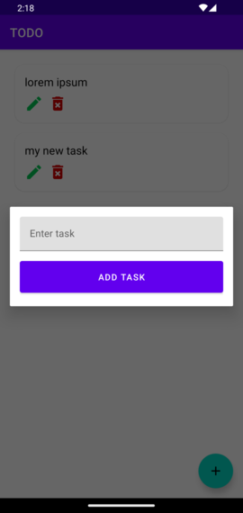
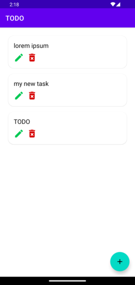
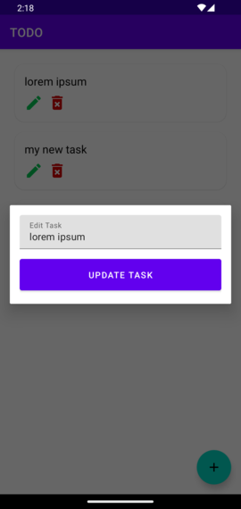

# Material Design TODO App (Android Java)

_A clean and modern TODO app built with Material Design and SQLite database._

## 📲 Download the App
You can download the latest APK from the **[Releases Section](https://github.com/TutorialsAndroid/TODO-App-Android-Java/apk)**.

## 📌 Features
- **Add Tasks**: Users can add new tasks with a simple dialog.
- **Edit Tasks**: Easily update tasks with an edit button.
- **Delete Tasks**: Remove tasks with a single click.
- **SQLite Database**: Uses SQLite to store tasks persistently.
- **Material Design UI**: Clean and modern interface following Google’s Material Design guidelines.

## 📱 Screenshots

| Add Task                                | Task List                                 | Edit Task                                 |
|-----------------------------------------|-------------------------------------------|-------------------------------------------|
|  |  |  |

## 📥 Installation

### **1️⃣ Clone the Repository**
```sh
 git clone https://github.com/TutorialsAndroid/TODO-App-Android-Java.git
```

### **2️⃣ Open in Android Studio**
- Open **Android Studio** and select **Open an Existing Project**.
- Navigate to the cloned folder and open the project.

### **3️⃣ Build & Run**
- Connect an **Android device** or start an **Emulator**.
- Click **Run ▶️** to install and launch the app.

## ⚙️ How It Works

### **1️⃣ Adding a Task**
- Click the **Floating Action Button (FAB)**.
- A dialog appears where you enter the task name.
- Click **Add Task** and the task is saved to the database.

### **2️⃣ Editing a Task**
- Click the **Edit** button on a task.
- Modify the task name and click **Update**.

### **3️⃣ Deleting a Task**
- Click the **Delete** button, and the task is removed from the list and database.

## 📂 Project Structure
```
📁 app/src/main/java/com/example/todoapp/
 ├── 📄 MainActivity.java          # Main screen with task list
 ├── 📄 TaskAdapter.java           # RecyclerView adapter for tasks
 ├── 📄 Task.java                  # Task model class
 ├── 📄 DatabaseHelper.java        # SQLite database management
 ├── 📄 AddTaskDialog.java         # Dialog for adding tasks
 ├── 📄 EditTaskDialog.java        # Dialog for editing tasks
```

## 🗄️ SQLite Database Structure
The app uses an **SQLite database** to store tasks persistently.

### **Database: `tasks.db`**
| Column | Type | Description |
|--------|------|-------------|
| `id` | INTEGER PRIMARY KEY AUTOINCREMENT | Unique task ID |
| `title` | TEXT | Task name |

### **SQL Queries Used**
- **Create Table**
```sql
CREATE TABLE tasks (
    id INTEGER PRIMARY KEY AUTOINCREMENT,
    title TEXT
);
```

- **Insert Task**
```sql
INSERT INTO tasks (title) VALUES ('New Task');
```

- **Retrieve Tasks**
```sql
SELECT * FROM tasks;
```

- **Update Task**
```sql
UPDATE tasks SET title = 'Updated Task' WHERE id = 1;
```

- **Delete Task**
```sql
DELETE FROM tasks WHERE id = 1;
```

## 🛠️ Technologies Used
- **Java** (Android Development)
- **SQLite** (Database)
- **RecyclerView** (Task List UI)
- **Material Design Components** (UI Design)

## 🏗️ Future Improvements
✅ Task Categories 📂  
✅ Task Reminders ⏰  
✅ Dark Mode 🌙

## 🙌 Contributing
Pull requests are welcome! For major changes, please open an issue first to discuss what you’d like to improve.

## 📜 License
This project is **open-source** and available under the [MIT License](LICENSE).

---
🚀 **Happy Coding!** 🚀